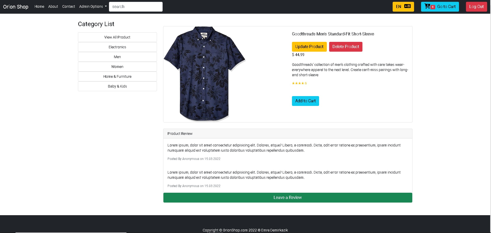

# Orion Innovation Bootcamp Graduation Project

## You can reach the project description video by clicking on the link or image below.

### https://youtu.be/b8bwKFagqmo

[](https://youtu.be/b8bwKFagqmo)

## Installation

1. Clone the repo

```sh
git clone https://github.com/Emreedk/Orion-innovation-bootcamp-graduation-project-Emreedk.git
```

2. Install NPM packages

```sh
npm install
```

3. Run Angular Project

```sh
ng serve --o
```

4. Run JSON-server

```sh
npm run server
```

### To login as an admin;

e-mail: admin@admin.com
password : Admin123

### To log in as a user;

e-mail: user@user.com
password: User123

## About Project

This Project is Patika-Orion Innovation Turkey Angular Bootcamp graduation project. In this project, I created an e-commerce clone.

## Features

### ECommerce App Core Functionalities

- User Authentication
- Validations for user-friendly design
- Restricted access to access the products
- Displaying products
- Searching products by product name
- Filtering products by category - Available through sidebar
- Adding products to basket
- Creating order after reviewing the basket
- Admin dashboard
- CRUD operations ( create, read, update , delete )
- Multi-language support (english - turkish)

# Package and Modules

- AppRoutingModule
- HttpClientModule
- FormsModule
- RouterModule
- ReactiveFormsModule
- Font Awesome
- Bootstrap
- AuthGuard
- Interceptors
- Transloco

# Tech Stack

- Angular 13
- TypeScript
- SCSS
- RxJS
- Angular Material

# Orion Innovation Angular/Frontend Bootcamp Bitirme Projesi

• Ürün satışının, kullanıcı kaydının ve girişinin yapıldığı, yeni ürünlerin eklenip, güncellenibildiği ve silinebildiği bir web uygulaması geliştirilecek.

# Fonksiyoneliteler:

• Uygulama responsive tasarımı desteklemeli, mobil ve bilgisayar ekranlarına uyumlu çalışmalı (ui component frameworkleri, libraryleri kullanılabilir)

• Kullanıcılar uygulamaya üye olabilmeli ve giriş yapabilmeli (json dosyasına kayıt oluşturulup, json dosyasından doğrulama yapılabilir, ya da ekstra bir api yazılabilir)

• Ürün kartında bulunması gerekenler; ürünlerin resmi, adı, açıklaması ve fiyatı

• Ürün listesi ana sayfada gösterilmeli, kullanıcılar isterlerse ürünlerin detayına, ürünlerin üzerine tıklayarak bakabilmeli

• Ürünlerin detay sayfasında, ürünün daha büyük bir resmi ve daha detaylı bir açıklama metni olmalı

• Ürünlerin filtrelenmesi için; kategori seçeneği (dropdown, selector, kategorileri siz belirlemelisiniz) ve bir arama çubuğu oluşturulmalı, anahtar kelimesinin ürün adında geçip geçmediğine bakılmalı

• Ürün detayına gidilirken, sayfa yönlendirilmesi (routing) yapılmalı

• Ürünler kendinizin belirleyeceği bir json kaynak dosyasından alınmalı

• Ürünler sepete eklenip daha sonrasında satış işlemi gerçekleştirilmeli

• Satış işlemi için ayrı bir json dosyasına log kaydı atılması yeterli

• Authentication ve Authorization katmanları olmalı, sistemde iki tip aktör olmalı (public kullanıcı, site yöneticisi). Public kullanıcı ürünleri görüntüleyebilir, filtreleyebilir, sepete ekleyebilir ve satış işlemini gerçekleştirebilir. Site yöneticisi ise yeni ürün ekleyebilir, mevcut ürünlerin içeriklerini güncelleyebilir ve silebilir. Public kullanıcı ürünlerin yönetildiği sayfaya erişim sağlayamamalı.

• Ürünler kart listesi olarak görüntülenebildiği gibi, bir tabloda da görüntülenebilmeli (kullanıcıya seçim yaptırılmalı)

• Ürünler içeriklerine göre detaylı bir şekilde filtrelenebilmeli

• Site yöneticisi yeni ürün ekleme ekranında, formda herhangi bir değişiklik yaptığı durumda, başka bir sayfaya route etmek isterse kaydedilmemiş değişiklikleriniz bulunmaktadır tarzında bir uyarı ile karşılaşmalı ve onaylarsa route işlemi yapılmalı, onaylamazsa aynı sayfada kalmalı

• Authentication için kullanıcı bilgileri local storage da tutulmalı
